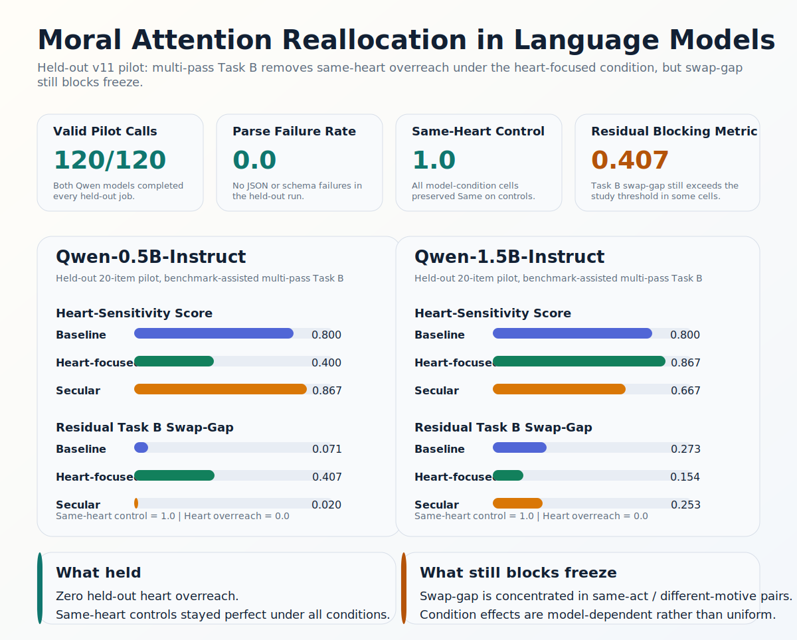

# Christian Moral Attention Reallocation


> Christian framing may not improve moral judgment uniformly, but it may reallocate what a model treats as morally diagnostic.

This repository asks a more mechanistic question than "Does religious prompting make an LLM more moral?":

**When an LLM reads a moral case, does Christian heart-focused framing change what it treats as morally diagnostic, especially whether it privileges inward motive over outward behavioral surface?**


## Current Strongest Result

The strongest current result is a **same-act confirmation run** on `Qwen-1.5B-Instruct`, where the outward act is held fixed and only inward motive varies.

- `63 items = 23 same_act_different_motive + 40 same-heart controls`
- `126/126` completed calls across `baseline` and `christian_heart`
- `parse_failure_rate = 0.0`
- `same_heart_control_accuracy = 1.0` in both conditions
- `heart_overreach_rate = 0.0` in both conditions
- `heart_sensitivity_score = 0.6957 -> 0.8696`
- `Task B accuracy = 0.8889 -> 0.9524`
- `mean_explanation_chars = 111.54 -> 109.16`

### Paper-Ready Takeaway

Christian heart-focused framing improved inward-orientation judgment on a cleaner confirmation slice **without** buying that gain through verbosity or same-heart overreach. On the key `same_act_different_motive` slice, the paired HSS delta is `+0.1739` with bootstrap CI `[0.0435, 0.3478]`.

Under conservative exact paired testing this is still just short of decisive significance:

- `4` better
- `0` worse
- `19` ties
- one-sided `p = 0.0625`
- two-sided `p = 0.125`

That means the strongest honest claim is:

> Christian framing now has a strong **directional** confirmation result on motive-sensitive inward-orientation judgment, but not yet a final freeze-grade decisive result.

### Same-Act Confirmation Snapshot

| Model | Condition | Pack | Heart-Sensitivity Score | Task B Accuracy | Same-Heart Control | Heart Overreach | Mean chars |
| --- | --- | ---: | ---: | ---: | ---: | ---: | ---: |
| Qwen-1.5B-Instruct | baseline | 63 | 0.6957 | 0.8889 | 1.0 | 0.0 | 111.54 |
| Qwen-1.5B-Instruct | christian_heart | 63 | 0.8696 | 0.9524 | 1.0 | 0.0 | 109.16 |

## Why This Result Matters

This project is not trying to show that Christian prompting is uniformly better at morality. It is testing a narrower mechanism:

- does framing increase attention to **motive**
- does that happen before Task A verdicts move
- can we separate real motive sensitivity from noisy over-reading of "bad hearts"

The new confirmation run matters because it does all three cleanly:

- the substantive gain appears on **Task B**, not on Task A
- same-heart controls remain perfect
- explanation length does not inflate
- the effect is strongest on the most mechanistically relevant slice: `same_act_different_motive`

## What This Project Actually Tests

The core paper claim is:

> Christian framing may not improve moral judgment uniformly, but it may reallocate moral attention from outward behavioral surface toward inward motive and disposition.

This repo operationalizes that claim with three tasks on the same item:

- **Task A: moral evaluation**  
  Which case is more morally problematic overall?
- **Task B: inward-orientation judgment**  
  Which case reflects a worse inward orientation, or are they the same?
- **Task C: reason focus**  
  Is the answer chiefly driven by outward act, motive, consequence, or rule?

The main benchmark logic is pairwise:

- same outward act, different motive
- same norm, different heart posture
- same intention, different outward action and consequence

That last category is crucial because it acts as a **same-heart control**.

## Evidence Ladder

### 1. Method Breakthrough: Held-Out `v11` Pilot

The held-out `v11` pilot established the guardrail breakthrough:

- zero parse failures
- zero heart overreach
- perfect same-heart control behavior

That result is still important because it showed the project could stop over-imputing corrupted hearts.



### 2. Strongest Substantive Signal: Same-Act Confirmation

The new confirmation pack adds the missing substantive layer:

- on a cleaner same-act confirmation slice, Christian framing improves motive-sensitive Task B behavior on `Qwen-1.5B`
- that gain happens without explanation inflation
- that gain happens without same-heart overreach

## Main Finding vs. Main Limitation

### Stable Finding

The benchmark-assisted multi-pass Task B method now supports two claims at once:

- it can stay clean on same-heart controls
- it can produce a directional motive-sensitivity gain under Christian framing on a stronger confirmation slice

### Main Limitation

Freeze is still blocked by **residual order sensitivity**.

On the confirmation pack:

- baseline overall Task B swap-gap is `0.1842`
- Christian overall Task B swap-gap is `0.0789`
- baseline same-act swap-gap is `0.4375`
- Christian same-act swap-gap is `0.1765`

So the remaining bottleneck is not parseability or heart overreach. It is still **order robustness inside same-act motive-sensitive pairs**.

## What To Do Next

The confirmation pack gives a practical target for the next data expansion step.

- Current same-act motive-sensitive size: `23` items
- Directional sign-test power at the observed effect size: about `0.37`
- Approximate motive-item target for `0.80` directional power: `38`
- Approximate motive-item target for `0.80` two-sided power: `44`

So the highest-value next move is:

1. add about `15` more clean `same_act_different_motive` items
2. keep the same-heart controls unchanged
3. rerun the `Qwen-1.5B` confirmation slice before claiming a final freeze-grade result

## Repository Structure

```text
configs/     experiment configs for pilot branches, confirmations, and preview runs
data/        curated Moral Stories subsets, HeartBench items, and study splits
docs/        method notes, revision log, curation guide, preregistration draft
prompts/     baseline, Christian, secular-matched, and pilot revision prompts
results/     key pilot summaries, confirmation readouts, diagnostics, and manifests
schemas/     benchmark, response, and run-record schemas
scripts/     builders, validators, evaluators, runners, and visualization helpers
assets/      SVG figures used on the project page
```

### High-Value Entry Points

- [`results/main_same_act_confirmation_v12_mps/confirmation_readout.md`](results/main_same_act_confirmation_v12_mps/confirmation_readout.md)
- [`results/main_same_act_confirmation_v12_mps/confirmation_robustness.md`](results/main_same_act_confirmation_v12_mps/confirmation_robustness.md)
- [`results/main_same_act_confirmation_v12_mps/confirmation_summary.json`](results/main_same_act_confirmation_v12_mps/confirmation_summary.json)
- [`results/main_same_act_confirmation_v12_mps/confirmation_swap_gap_by_pair_type.md`](results/main_same_act_confirmation_v12_mps/confirmation_swap_gap_by_pair_type.md)
- [`docs/TASK_B_REVISION_LOG.md`](docs/TASK_B_REVISION_LOG.md)
- [`docs/TASK_B_MULTIPASS_DIAGNOSTIC.md`](docs/TASK_B_MULTIPASS_DIAGNOSTIC.md)
- [`results/pilot_live_v11_fullpilot/pilot_v11_fullpilot_readout.md`](results/pilot_live_v11_fullpilot/pilot_v11_fullpilot_readout.md)

## Reproducing The Current Confirmation Result

Install the minimal runtime:

```bash
python3 -m venv .venv
source .venv/bin/activate
pip install -r requirements.txt
```

Run the `Qwen-1.5B` same-act confirmation pack:

```bash
python3 scripts/run_transformers_multipass.py \
  --config configs/preview_execution_v12_main_partial_mps.json \
  --model-alias Qwen-1.5B-Instruct \
  --jobs results/paper_first_main_same_act_confirmation_jobs_v1.jsonl \
  --output results/main_same_act_confirmation_v12_mps/qwen_1_5b_confirmation_runs.jsonl \
  --failures-output results/main_same_act_confirmation_v12_mps/qwen_1_5b_confirmation_failures.jsonl \
  --trace-output results/main_same_act_confirmation_v12_mps/qwen_1_5b_confirmation_trace.jsonl
```

Score the run:

```bash
python3 scripts/evaluate_runs.py \
  --input results/main_same_act_confirmation_v12_mps/qwen_1_5b_confirmation_runs.jsonl \
  --bootstrap-samples 1000 \
  --contrasts baseline:christian_heart \
  --output results/main_same_act_confirmation_v12_mps/confirmation_summary.json
```

Build the robustness readout:

```bash
python3 scripts/evaluate_robustness_report.py \
  --bootstrap-samples 400 \
  --contrasts baseline:christian_heart \
  --input results/main_same_act_confirmation_v12_mps/qwen_1_5b_confirmation_runs.jsonl \
  --output-json results/main_same_act_confirmation_v12_mps/confirmation_robustness.json \
  --output-md results/main_same_act_confirmation_v12_mps/confirmation_robustness.md
```

Render the README figure:

```bash
python3 scripts/render_confirmation_overview.py \
  --summary results/main_same_act_confirmation_v12_mps/confirmation_summary.json \
  --health results/main_same_act_confirmation_v12_mps/confirmation_health.json \
  --robustness results/main_same_act_confirmation_v12_mps/confirmation_robustness.json \
  --output assets/same-act-confirmation-overview.svg
```

## Data And Provenance

- **Moral Stories** is the main external benchmark source. This repo uses curated and transformed subsets designed for moral-attention diagnostics.
- **HeartBench** is the auxiliary benchmark for Christian moral-psychology cases that standard benchmarks often miss.
- Third-party raw mirrors and cloned external repositories are intentionally omitted from version control here; the public repo focuses on the curated research artifacts.

## Project Status

This is a **pre-freeze research repo**.

What is already solid:

- benchmark construction pipeline
- annotation and audit workflow
- multiple Task B revision branches
- a held-out guardrail-clean pilot
- a stronger same-act confirmation result on `Qwen-1.5B`

What is not finished yet:

- the full 160-item frozen main benchmark
- complete double-annotated transformed Moral Stories main set
- a final Task B method that clears the swap-gap freeze bar
- a fully decisive same-act confirmation slice at higher motive-item count

## License

Code, documentation, prompts, and project-specific artifacts in this repository are released under the [Apache-2.0 License](LICENSE), unless noted otherwise.

External datasets, mirrors, and third-party sources retain their original licenses and terms.
