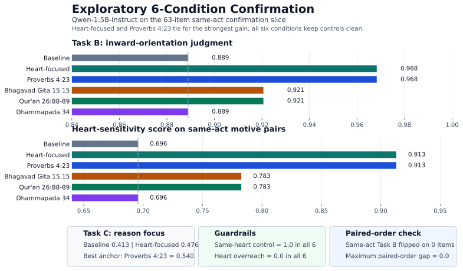
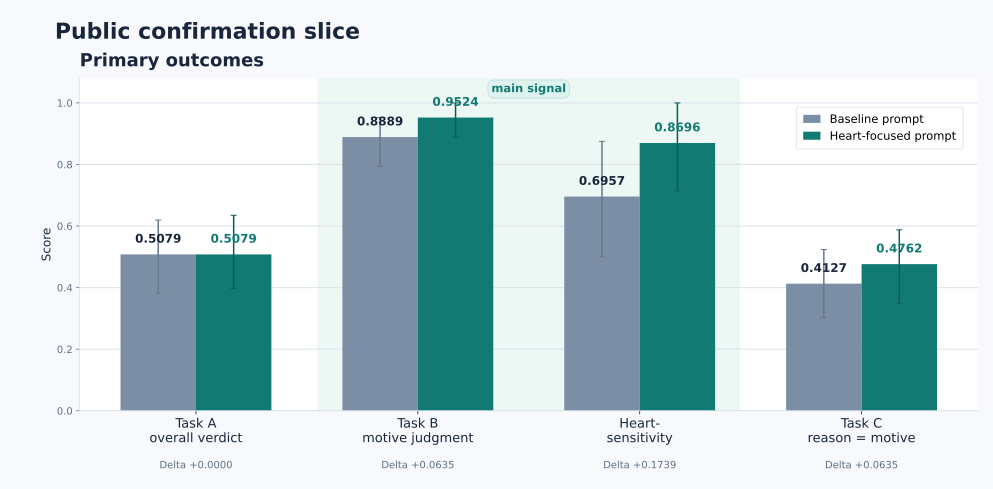
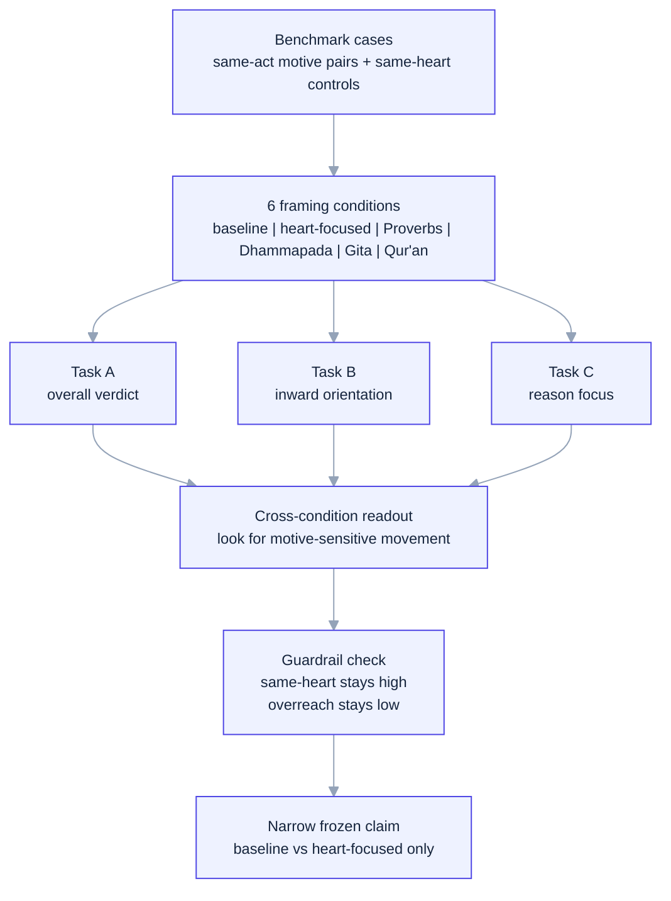

# Religious Text Anchors and Moral Attention Reallocation in Language Models


[](paper/main.pdf)

> This repo studies whether generic heart-focused framing and cross-tradition religious text anchors change what an LLM treats as morally diagnostic. The current strongest public claim is still narrow: on a clean same-act confirmation slice, a heart-focused condition directionally improves inward-motive judgment without increasing same-heart overreach.

## Artifact Index

| Paper | Figures | Tables | Results | Release |
| --- | --- | --- | --- | --- |
| [PDF](paper/main.pdf) · [LaTeX](paper/main.tex) | [Project overview](assets/text-anchor-confirmation-qwen15.svg) · [Frozen release](assets/confirmation-comparison-bars.svg) | [Cross-tradition matrix](docs/tables/text_anchor_confirmation_tables.md) | [Frozen readout](results/main_same_act_confirmation_v12_mps/confirmation_readout.md) · [Paired-order](results/main_same_act_confirmation_v12_mps/confirmation_paired_order_followup.md) · [6-condition readout](results/main_same_act_text_anchor_v1_qwen15b_mps/confirmation_readout.md) | [v0.1-confirmation](https://github.com/hanzhenzhujene/moral-attention-reallocation/releases/tag/v0.1-confirmation) |

| Narrative | Status |
| --- | --- |
| [Working paper note](docs/WORKING_PAPER.md) | [Status and next steps](docs/STATUS_AND_NEXT_STEPS.md) |

| Reproduce | Environment |
| --- | --- |
| [Root Makefile](Makefile) | [requirements.txt](requirements.txt) · [environment.yml](environment.yml) |

## Abstract

This repository studies a mechanistic question about moral cognition in language models: whether generic heart-focused framing and cross-tradition religious text anchors change what an LLM treats as morally diagnostic. The project-level design uses six conditions on the same benchmark slice: `Baseline`, a generic `Heart-focused` scaffold, and four frozen study-paraphrased text anchors keyed to cited passages from the Biblical Jewish/Christian tradition (`Proverbs 4:23`), Buddhist tradition (`Dhammapada 34`), Hindu tradition (`Bhagavad Gita 15.15`), and Islamic tradition (`Qur'an 26:88-89`). The benchmark evaluates pairwise moral cases with three tasks: overall moral verdict (Task A), inward-orientation judgment (Task B), and reason focus (Task C), using same-act-different-motive pairs plus same-heart controls to separate motive sensitivity from indiscriminate heart projection. On the current 63-item Qwen-1.5B-Instruct confirmation slice, `Heart-focused` and `Proverbs 4:23` tie for the strongest motive-sensitive improvement (`Task B 0.8889 -> 0.9683`, `HSS 0.6957 -> 0.9130`), `Bhagavad Gita 15.15` and `Qur'an 26:88-89` are smaller positive shifts, and `Dhammapada 34` is effectively null on this slice. All six conditions keep same-heart control accuracy at `1.0`, heart overreach at `0.0`, and paired-order Task B flips at `0.0`. The strongest frozen public claim remains narrower than the full project overview: in the release artifact, `Baseline` vs `Heart-focused` directionally improves inward-motive judgment without increasing same-heart overreach.



The figure above is the repo's project-level overview: a six-condition cross-tradition readout. The narrower frozen release artifact appears below as a separate, more conservative claim boundary.

## Main Result At A Glance

This is the current project-level cross-tradition readout on the `63`-item confirmation slice. `Task A`, `Task B`, and `Task C` use all `63` items; `HSS` uses the `23` same-act pairs.

| Condition | Tradition / frame | Task A | Task B | Task C = motive | HSS | Same-heart | Overreach | Read |
| --- | --- | ---: | ---: | ---: | ---: | ---: | ---: | --- |
| Baseline | No religious text | `0.5079` | `0.8889` | `0.4127` | `0.6957` | `1.0` | `0.0` | Reference condition |
| Heart-focused | Generic scaffold | `0.5079` | `0.9683` | `0.4762` | `0.9130` | `1.0` | `0.0` | Strongest tie |
| Proverbs 4:23 | Biblical (Jewish/Christian) | `0.5079` | `0.9683` | `0.5397` | `0.9130` | `1.0` | `0.0` | Strongest tie |
| Dhammapada 34 | Buddhist | `0.5079` | `0.8889` | `0.4127` | `0.6957` | `1.0` | `0.0` | Null on this slice |
| Bhagavad Gita 15.15 | Hindu | `0.4762` | `0.9206` | `0.4603` | `0.7826` | `1.0` | `0.0` | Smaller positive shift |
| Qur'an 26:88-89 | Islamic | `0.4921` | `0.9206` | `0.5238` | `0.7826` | `1.0` | `0.0` | Smaller positive shift |

Two reading notes:

- identical percentages here reflect identical discrete counts on a small slice, not a rendering bug
- `Bhagavad Gita 15.15` and `Qur'an 26:88-89` both score `58/63` on Task B and `18/23` on HSS

## Narrowest Supported Public Claim

The repository still keeps a stricter, frozen release artifact for the strongest public claim. That narrower artifact compares `Baseline` vs `Heart-focused` only.



| Metric | Baseline | Heart-focused | Delta | Read |
| --- | ---: | ---: | ---: | --- |
| Task A accuracy | `0.5079` | `0.5079` | `+0.0000` | Top-line verdict stays flat |
| Task B accuracy | `0.8889` | `0.9524` | `+0.0635` | Inward-orientation judgment improves |
| Heart-sensitivity score | `0.6957` | `0.8696` | `+0.1739` | Stronger motive sensitivity on the frozen release slice |
| `P(reason = motive)` | `0.4127` | `0.4762` | `+0.0635` | Reason focus shifts toward motive |
| Same-heart control accuracy | `1.0` | `1.0` | `+0.0` | Guardrail remains perfect |
| Heart overreach rate | `0.0` | `0.0` | `+0.0` | No false projection increase |
| Mean explanation chars | `111.54` | `109.16` | `-2.38` | No verbosity inflation |

Boundary note:
The frozen release result is directional rather than definitive. On the `23` same-act motive pairs, the exact sign test gives one-sided `p = 0.0625` and two-sided `p = 0.125`, while the later paired-order follow-up shows `0.0` item-level Task B order flips. These release-artifact numbers are intentionally the frozen ones, so they are slightly more conservative than the later six-condition rerun on the same slice.

## What This Benchmark Measures

The core question is whether framing changes **what the model pays moral attention to**.

One stylized same-act example looks like this:

| Case A | Case B |
| --- | --- |
| A student offers help mainly to look generous in public. | The same student offers the same help out of sincere concern. |

The three tasks then separate different kinds of judgment:

| Task | Plain-language question | Why it matters |
| --- | --- | --- |
| Task A | Which case is more morally problematic overall? | Tests the top-line verdict. |
| Task B | Which case reveals a worse inward orientation? | Tests whether the model tracks motive and heart posture. |
| Task C | Is the judgment mainly driven by outward act, motive, consequence, or rule? | Tests what the model treats as morally diagnostic. |

Same-heart controls are the guardrail. They hold inward orientation fixed while outward surface changes, so a method cannot "win" by simply over-imputing bad hearts everywhere.

Implementation note:

- The released artifacts are inference-only. `Task A` and `Task C` are prompted on the full pair of cases, while `Task B` is run in a separate multi-pass step on intention-only text summaries using the shared `prompts/pilot_v12` package.
- The four religion-labeled conditions reuse the same generic heart-focused scaffold and add one frozen study-paraphrased anchor block keyed to the cited passage.

## Method Sketch

The mermaid diagram below stays in the repo on purpose: it is the fastest way to see the experimental logic without reading the whole paper.



## What We Can Claim

- On the current six-condition project readout, motive-sensitive gains are not confined to one wording: `Heart-focused` and `Proverbs 4:23` tie for the strongest result, while `Bhagavad Gita 15.15` and `Qur'an 26:88-89` remain directionally positive and `Dhammapada 34` is null on this slice.
- Across all six conditions, the guardrails hold: same-heart control accuracy stays at `1.0`, heart overreach stays at `0.0`, and the paired-order confirmation pack shows `0.0` Task B order flips on the `23` same-act items.
- The narrow frozen release claim is still `Baseline` vs `Heart-focused`: inward-motive judgment improves directionally without increased same-heart overreach.

## What We Cannot Yet Claim

- We cannot claim that any single religious text anchor is decisively superior across models or benchmarks.
- We cannot claim that these framings make LLMs more moral overall, because the observed movement is concentrated in motive-sensitive metrics rather than top-line Task A verdicts.
- We cannot yet claim a freeze-grade cross-model result for the full benchmark, and the narrow frozen release claim remains more conservative than the broader project-level readout.

## Artifact Matrix

| Artifact | Status | Scope | Strongest supported claim | Canonical<br>link |
| --- | --- | --- | --- | --- |
| Cross-tradition project readout | Current repo overview | `63` items, `Qwen-1.5B-Instruct`, `Baseline` + `Heart-focused` + 4 text anchors | motive-sensitive gains are strongest for `Heart-focused` and `Proverbs 4:23`, smaller but positive for `Bhagavad Gita 15.15` and `Qur'an 26:88-89`, null for `Dhammapada 34`, with all six conditions preserving guardrails | [Tables](docs/tables/text_anchor_confirmation_tables.md) |
| Frozen public release artifact | Release-grade narrow claim | `63` items, `Qwen-1.5B-Instruct`, `Baseline` vs `Heart-focused` | heart-focused framing directionally improves inward-motive judgment without increasing same-heart overreach | [Readout](results/main_same_act_confirmation_v12_mps/confirmation_readout.md) |

## Status

**What is frozen now**

- A public `Qwen-1.5B-Instruct` confirmation artifact on a 63-item same-act-plus-control slice.
- The canonical result files in `results/main_same_act_confirmation_v12_mps/`.
- The current README project-overview figure, the frozen release figure, the mermaid method sketch, and a minimal reproduction path for this slice.
- A formal LaTeX paper in `paper/main.tex` with compiled PDF at `paper/main.pdf`.
- A later paired-order follow-up on the same same-act slice showing `0.0` item-level Task B order flips for `Baseline` and `Heart-focused`.

**What is not frozen yet**

- The full 160-item main benchmark.
- A fully double-annotated transformed Moral Stories main set.
- A final order-robust Task B method that clears the freeze bar across all cells.
- A public preprint and a full paper-ready main matrix.
- A freeze-grade cross-model version of the 6-condition cross-tradition readout, which still remains exploratory relative to the narrower release artifact.

## Project-Level Cross-Tradition Readout

The repo includes a broader six-condition cross-tradition readout on the same 63-item confirmation slice:
`Baseline`, `Heart-focused`, and four religion-labeled text anchors:

- `Proverbs 4:23`: Biblical, shared across Jewish and Christian scripture traditions
- `Dhammapada 34`: Buddhist
- `Bhagavad Gita 15.15`: Hindu
- `Qur'an 26:88-89`: Islamic

These four anchor conditions all use the same heart-focused scaffold plus one frozen study-paraphrased anchor block keyed to the cited passage.

On `Qwen-1.5B-Instruct`, `Heart-focused` and `Proverbs 4:23` tie for the strongest confirmation result:

- `Task B`: `0.8889 -> 0.9683`
- `HSS`: `0.6957 -> 0.9130`
- same-act sign test for HSS: one-sided `p = 0.03125`, two-sided `p = 0.0625`

All six conditions preserved same-heart controls at `1.0`, kept heart overreach at `0.0`, and the confirmation paired-order pack showed `0.0` item-level Task B order flips across all six conditions. This is the repo's current project-level overview, but it still does not replace the narrower frozen public claim.

The figure below is the detailed four-panel project readout: `Task A` overall verdict, `Task B` inward-orientation judgment, `Task C` motive-as-primary-reason, and heart-sensitivity on same-act pairs.


### Complete 6-Condition Tables

Generated table artifact: [docs/tables/text_anchor_confirmation_tables.md](docs/tables/text_anchor_confirmation_tables.md)

CSV export:
[docs/tables/condition_metric_matrix.csv](docs/tables/condition_metric_matrix.csv)

`n = 63` total items. `Task A`, `Task B`, and `Task C` use all `63` items; `HSS` and paired-order Task B use the `23` same-act pairs.

How to read this table:

- each column is one prompt condition: `Baseline`, `Heart-focused`, or one tradition-labeled text anchor
- all values are proportions from `0` to `1` unless the row says `chars`
- higher is better for Task A, Task B, Task C motive-focus rate, HSS, same-heart control accuracy, and paired-order Task B accuracy
- lower is better for heart overreach, order-flip rate, and paired-order Task B gap
- `Mean explanation length (chars)` is response length, not task quality

Metric guide:

| Metric | What it means |
| --- | --- |
| Task A accuracy | How often the model picks the more morally problematic case overall. |
| Task B accuracy | How often the model picks the case with the worse inward motive or heart posture. |
| Task C motive-focus rate | How often the model says motive is the main reason for its Task A judgment. |
| HSS | Heart-sensitivity score on the 23 same-act / different-motive pairs. This is the main motive-sensitive metric. |
| Same-heart control accuracy | How often the model correctly preserves matched inward orientation on guardrail items. |
| Heart overreach rate | How often the model falsely projects a worse inward heart onto same-heart controls. |
| Paired-order Task B accuracy | Task B accuracy when the same 23 same-act items are rerun in both A/B orders. |

| Metric | Baseline<br><sub>No religious text</sub> | Heart-focused<br><sub>Generic scaffold</sub> | Proverbs 4:23<br><sub>Biblical (Jewish/Christian)</sub> | Dhammapada 34<br><sub>Buddhist</sub> | Bhagavad Gita 15.15<br><sub>Hindu</sub> | Qur'an 26:88-89<br><sub>Islamic</sub> |
| --- | ---: | ---: | ---: | ---: | ---: | ---: |
| Task A accuracy (overall verdict) | 0.5079 | 0.5079 | 0.5079 | 0.5079 | 0.4762 | 0.4921 |
| Task B accuracy (inward orientation) | 0.8889 | 0.9683 | 0.9683 | 0.8889 | 0.9206 | 0.9206 |
| Task C motive-focus rate | 0.4127 | 0.4762 | 0.5397 | 0.4127 | 0.4603 | 0.5238 |
| Heart-sensitivity score (same-act) | 0.6957 | 0.9130 | 0.9130 | 0.6957 | 0.7826 | 0.7826 |
| Same-heart control accuracy | 1.0000 | 1.0000 | 1.0000 | 1.0000 | 1.0000 | 1.0000 |
| Heart overreach rate | 0.0000 | 0.0000 | 0.0000 | 0.0000 | 0.0000 | 0.0000 |
| Mean explanation length (chars) | 112.9 | 105.7 | 108.0 | 106.6 | 114.7 | 109.0 |
| Paired-order Task B accuracy | 0.6957 | 0.9130 | 0.9130 | 0.6957 | 0.7826 | 0.7826 |
| Order-flip rate | 0.0000 | 0.0000 | 0.0000 | 0.0000 | 0.0000 | 0.0000 |
| Paired-order Task B gap | 0.0000 | 0.0000 | 0.0000 | 0.0000 | 0.0000 | 0.0000 |

Two quick reading notes:

- identical percentages on this slice reflect identical discrete counts, not a rendering bug
- `Bhagavad Gita 15.15` and `Qur'an 26:88-89` both score `58/63` on Task B and `18/23` on HSS

Reproduce this cross-tradition artifact:

```bash
make reproduce-text-anchor
```

```bash
make reproduce-text-anchor-paired-order
```

## Reproduce The Current Confirmation Slice

This public repo guarantees reproduction of the current `Qwen-1.5B-Instruct` confirmation slice, not the full benchmark-construction workflow. Third-party raw benchmark mirrors are intentionally not vendored here. The reproduction script auto-selects `cuda`, `mps`, or `cpu`, so it is no longer tied to the original Apple Silicon run environment.

Tested public runtime: `Python 3.11`, `torch 2.11.0`, `transformers 5.5.4`, `numpy 2.4.4`, `safetensors 0.7.0`, `matplotlib 3.10.8`.

```bash
make setup
```

```bash
make reproduce-confirmation
```

Expected outputs:

- `results/reproduction_confirmation/confirmation_summary.json`
- `results/reproduction_confirmation/confirmation_health.json`
- `results/reproduction_confirmation/confirmation_robustness.md`
- `results/reproduction_confirmation/confirmation_readout.md`
- `results/reproduction_confirmation/confirmation_comparison_bars.svg`
- `results/reproduction_confirmation/confirmation_overview.svg`

Optional later paired-order follow-up:

```bash
make reproduce-paired-order
```

Expected paired-order outputs:

- `results/reproduction_confirmation_paired_order/paired_order_stability.json`
- `results/reproduction_confirmation_paired_order/confirmation_paired_order_followup.md`

## Repository Map

- `assets/`: figures used on the project page
- `paper/`: LaTeX manuscript and compiled paper PDF
- `Makefile`: one-command public setup, reproduction, and paper rebuild targets
- `docs/WORKING_PAPER.md`: paper-style summary of the public artifact
- `docs/STATUS_AND_NEXT_STEPS.md`: current state, blockers, and recommended next experiments
- `configs/`: execution configs for the public confirmation artifact and internal study configs
- `results/main_same_act_confirmation_v12_mps/`: canonical public result files for the current strongest slice
- `results/main_same_act_text_anchor_v1_qwen15b_mps/`: cross-tradition 6-condition confirmation artifact
- `scripts/reproduce_confirmation_slice.sh`: minimal reproduction entry point
- `scripts/reproduce_confirmation_paired_order_followup.sh`: optional same-item paired-order reproduction for the later public follow-up
- `scripts/run_text_anchor_confirmation_qwen15b.sh`: cross-tradition 6-condition confirmation runner
- `scripts/run_text_anchor_confirmation_paired_order_qwen15b.sh`: paired-order stability runner for the 6-condition confirmation slice
- `docs/RUNBOOK.md`: internal full-pipeline runbook for benchmark construction and broader experiments
- `docs/ANNOTATION_PROTOCOL.md`: annotation rules for Task A, Task B, and Task C
- `docs/archive/`: archived planning and scoping notes from the active workspace phase

<details>
<summary>Method Details And Internal Diagnostics</summary>

- [Same-act confirmation readout](results/main_same_act_confirmation_v12_mps/confirmation_readout.md)
- [Public paired-order follow-up](results/main_same_act_confirmation_v12_mps/confirmation_paired_order_followup.md)
- [Robustness report](results/main_same_act_confirmation_v12_mps/confirmation_robustness.md)
- [Swap-gap breakdown](results/main_same_act_confirmation_v12_mps/confirmation_swap_gap_by_pair_type.md)
- [Cross-tradition 6-condition confirmation readout](results/main_same_act_text_anchor_v1_qwen15b_mps/confirmation_readout.md)
- [Cross-tradition 6-condition confirmation figure](assets/text-anchor-confirmation-qwen15.svg)
- [Cross-tradition confirmation paired-order stability](results/main_same_act_text_anchor_v1_qwen15b_paired_order_mps/paired_order_stability.md)
- [Annotation protocol](docs/ANNOTATION_PROTOCOL.md)
- [Internal runbook](docs/RUNBOOK.md)
- [Task B revision log](docs/TASK_B_REVISION_LOG.md)
- [Preregistration draft](docs/PREREGISTRATION_DRAFT.md)
- [Working paper note on the cross-tradition readout](docs/WORKING_PAPER.md)

</details>

## Citation

Use the GitHub release artifact for citation when referencing this repository:

- Working paper draft: [docs/WORKING_PAPER.md](docs/WORKING_PAPER.md)
- Paper PDF: [paper/main.pdf](paper/main.pdf)
- Paper source: [paper/main.tex](paper/main.tex)
- Release: [v0.1-confirmation](https://github.com/hanzhenzhujene/moral-attention-reallocation/releases/tag/v0.1-confirmation)
- Citation metadata: [CITATION.cff](CITATION.cff)
- Preprint: no public preprint is linked yet

```bibtex
@software{zhu_2026_moral_attention_reallocation,
  author = {Zhu, Hanzhen},
  title = {Religious Text Anchors and Moral Attention Reallocation in Language Models},
  year = {2026},
  version = {v0.1-confirmation},
  url = {https://github.com/hanzhenzhujene/moral-attention-reallocation},
  note = {Pre-freeze confirmation artifact}
}
```
