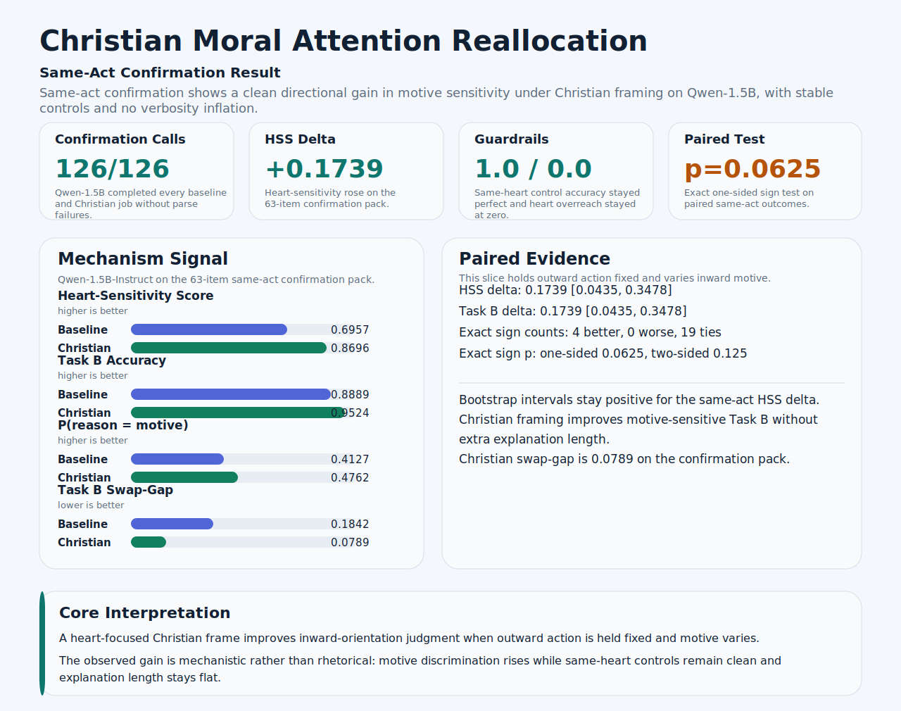
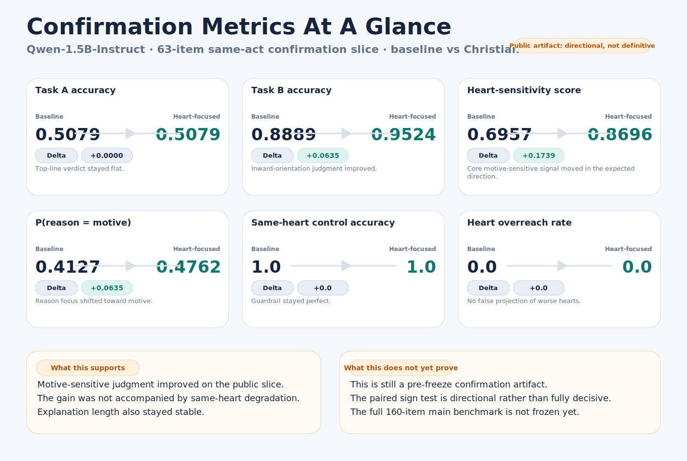

# Moral Attention Reallocation in Language Models


[](docs/WORKING_PAPER.md)

> This repo does not show that any single framing condition makes LLMs more moral overall. It shows that, on a clean same-act confirmation slice, a Christian heart-focused condition directionally improves inward-motive judgment without increasing same-heart overreach.

## Paper And Figures

- Working paper draft: [docs/WORKING_PAPER.md](docs/WORKING_PAPER.md)
- Main overview figure: [assets/same-act-confirmation-overview.svg](assets/same-act-confirmation-overview.svg)
- Metric scoreboard: [assets/confirmation-metric-scoreboard.svg](assets/confirmation-metric-scoreboard.svg)
- Canonical readout: [results/main_same_act_confirmation_v12_mps/confirmation_readout.md](results/main_same_act_confirmation_v12_mps/confirmation_readout.md)
- Release artifact: [v0.1-confirmation](https://github.com/hanzhenzhujene/moral-attention-reallocation/releases/tag/v0.1-confirmation)

## Abstract

This repository studies a narrow mechanistic question about moral cognition in language models: whether framing changes what the model treats as morally diagnostic. The current public confirmation slice uses a Christian heart-focused condition as the main probe against a baseline prompt. The benchmark logic centers on pairwise moral cases with three tasks: overall moral verdict (Task A), inward-orientation judgment (Task B), and reason focus (Task C). The key design uses same-act-different-motive pairs together with same-heart controls, so motive sensitivity can be separated from false projection of outwardly worse action into inwardly worse heart. On a 63-item Qwen-1.5B-Instruct confirmation slice, the Christian heart-focused condition improved Task B accuracy from `0.8889` to `0.9524` and heart-sensitivity score from `0.6957` to `0.8696`, while same-heart control accuracy remained `1.0` and heart-overreach remained `0.0`. Under conservative paired testing this is a directional confirmation result, not yet a final decisive main-benchmark claim. The broader project design includes matched secular controls, but the current public artifact is intentionally narrower: a pre-freeze confirmation slice with honest reproducibility boundaries.



The main overview figure above shows the benchmark logic and the strongest public claim: same-act motive sensitivity increases while same-heart guardrails stay intact.



The scoreboard above shows the public confirmation slice in publication-style form: `Task A` stays flat, `Task B` and `HSS` move in the expected direction, `Task C` shifts toward motive, and guardrails stay stable.

## Main Result At A Glance

| Metric | Baseline | Christian heart-focused | Delta | Read |
| --- | ---: | ---: | ---: | --- |
| Task A accuracy | `0.5079` | `0.5079` | `+0.0000` | Top-line verdict stays flat |
| Task B accuracy | `0.8889` | `0.9524` | `+0.0635` | Inward-orientation judgment improves |
| Heart-sensitivity score | `0.6957` | `0.8696` | `+0.1739` | Stronger motive sensitivity on the target slice |
| `P(reason = motive)` | `0.4127` | `0.4762` | `+0.0635` | Reason focus shifts toward motive |
| Same-heart control accuracy | `1.0` | `1.0` | `+0.0` | Guardrail remains perfect |
| Heart overreach rate | `0.0` | `0.0` | `+0.0` | No false projection increase |
| Mean explanation chars | `111.54` | `109.16` | `-2.38` | No verbosity inflation |

Significance note:
The public result is directional rather than definitive. On the `23` same-act motive pairs, the exact sign test gives one-sided `p = 0.0625` and two-sided `p = 0.125`.

## What This Benchmark Measures

The core question is whether framing changes **what the model pays moral attention to**.

One stylized same-act example looks like this:

| Case A | Case B |
| --- | --- |
| A student offers help mainly to look generous in public. | The same student offers the same help out of sincere concern. |

The three tasks then separate different kinds of judgment:

| Task | Plain-language question | Why it matters |
| --- | --- | --- |
| Task A | Which case is more morally problematic overall? | Tests the top-line verdict. |
| Task B | Which case reveals a worse inward orientation? | Tests whether the model tracks motive and heart posture. |
| Task C | Is the judgment mainly driven by outward act, motive, consequence, or rule? | Tests what the model treats as morally diagnostic. |

Same-heart controls are the guardrail. They hold inward orientation fixed while outward surface changes, so a method cannot "win" by simply over-imputing bad hearts everywhere.

## What We Can Claim

- On the current public confirmation slice, the Christian heart-focused condition directionally improves inward-motive judgment.
- The strongest movement is in Task B and heart-sensitivity, not in first-pass Task A verdicts.
- That gain does not come with higher same-heart overreach or longer explanations on this slice.

## What We Cannot Yet Claim

- We cannot claim that any single religious framing improves moral judgment overall across models or benchmarks.
- We cannot yet claim a freeze-grade decisive result for the full paper benchmark.
- We cannot yet claim that the current public confirmation result is uniquely Christian rather than a more general semantic reorientation, because the canonical public slice here is a baseline-vs-Christian comparison.

## Status

**What is frozen now**

- A public `Qwen-1.5B-Instruct` confirmation artifact on a 63-item same-act-plus-control slice.
- The canonical result files in `results/main_same_act_confirmation_v12_mps/`.
- The current README overview diagram and a minimal reproduction path for this slice.
- A linked working paper draft in `docs/WORKING_PAPER.md`.

**What is not frozen yet**

- The full 160-item main benchmark.
- A fully double-annotated transformed Moral Stories main set.
- A final order-robust Task B method that clears the freeze bar across all cells.
- A public preprint and a full paper-ready main matrix.

## Reproduce The Current Confirmation Slice

This public repo guarantees reproduction of the current `Qwen-1.5B-Instruct` confirmation slice, not the full benchmark-construction workflow. Third-party raw benchmark mirrors are intentionally not vendored here. The reproduction script auto-selects `cuda`, `mps`, or `cpu`, so it is no longer tied to the original Apple Silicon run environment.

```bash
python3 -m venv .venv && source .venv/bin/activate
```

```bash
pip install -r requirements.txt
```

```bash
bash scripts/reproduce_confirmation_slice.sh results/reproduction_confirmation
```

Expected outputs:

- `results/reproduction_confirmation/confirmation_summary.json`
- `results/reproduction_confirmation/confirmation_health.json`
- `results/reproduction_confirmation/confirmation_robustness.md`
- `results/reproduction_confirmation/confirmation_overview.svg`

## Repository Map

- `assets/`: figures used on the project page
- `docs/WORKING_PAPER.md`: paper-style summary of the public artifact
- `configs/`: execution configs for the public confirmation artifact and internal study configs
- `results/main_same_act_confirmation_v12_mps/`: canonical public result files for the current strongest slice
- `scripts/reproduce_confirmation_slice.sh`: minimal reproduction entry point
- `docs/RUNBOOK.md`: internal full-pipeline runbook for benchmark construction and broader experiments
- `docs/ANNOTATION_PROTOCOL.md`: annotation rules for Task A, Task B, and Task C
- `docs/archive/`: archived planning and scoping notes from the active workspace phase

<details>
<summary>Method Details And Internal Diagnostics</summary>

- [Same-act confirmation readout](results/main_same_act_confirmation_v12_mps/confirmation_readout.md)
- [Robustness report](results/main_same_act_confirmation_v12_mps/confirmation_robustness.md)
- [Swap-gap breakdown](results/main_same_act_confirmation_v12_mps/confirmation_swap_gap_by_pair_type.md)
- [Annotation protocol](docs/ANNOTATION_PROTOCOL.md)
- [Internal runbook](docs/RUNBOOK.md)
- [Task B revision log](docs/TASK_B_REVISION_LOG.md)
- [Preregistration draft](docs/PREREGISTRATION_DRAFT.md)

</details>

## Citation

Use the GitHub release artifact for citation when referencing this repository:

- Working paper draft: [docs/WORKING_PAPER.md](docs/WORKING_PAPER.md)
- Release: [v0.1-confirmation](https://github.com/hanzhenzhujene/moral-attention-reallocation/releases/tag/v0.1-confirmation)
- Citation metadata: [CITATION.cff](CITATION.cff)
- Preprint: no public preprint is linked yet

```bibtex
@software{zhu_2026_moral_attention_reallocation,
  author = {Zhu, Hanzhen},
  title = {Moral Attention Reallocation in Language Models},
  year = {2026},
  version = {v0.1-confirmation},
  url = {https://github.com/hanzhenzhujene/moral-attention-reallocation},
  note = {Pre-freeze confirmation artifact}
}
```
