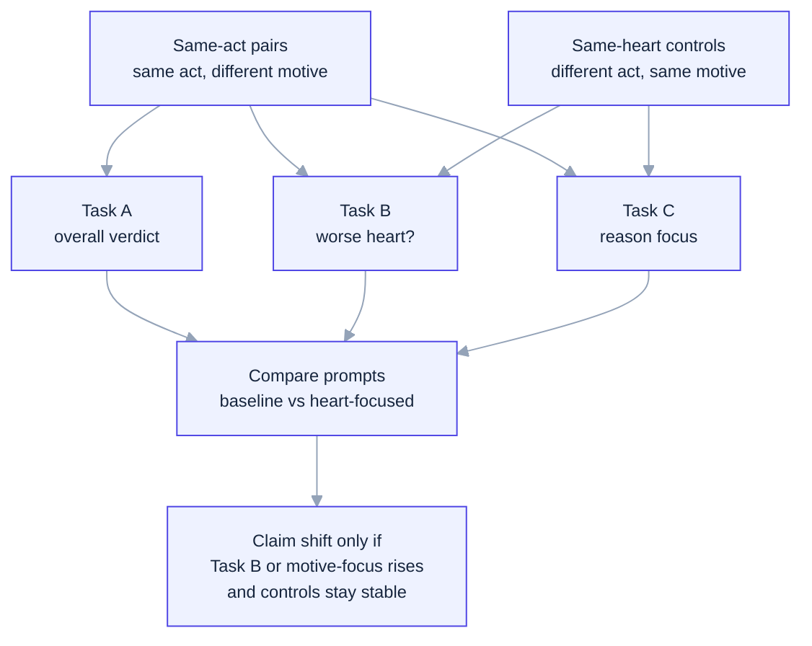

# Religious Text Anchors and Moral Attention Reallocation in Language Models


[](paper/main.pdf)

> This repo studies whether generic heart-focused framing and cross-tradition religious text anchors change what an LLM treats as morally diagnostic. The current strongest public claim is still narrow: on a clean same-act confirmation slice, a heart-focused condition directionally improves inward-motive judgment without increasing same-heart overreach.

## Paper And Figures

- Paper PDF: [paper/main.pdf](paper/main.pdf)
- LaTeX source: [paper/main.tex](paper/main.tex)
- Main comparison figure: [assets/confirmation-comparison-bars.svg](assets/confirmation-comparison-bars.svg)
- Exploratory 6-condition figure: [assets/text-anchor-confirmation-qwen15.svg](assets/text-anchor-confirmation-qwen15.svg)
- Exploratory 6-condition tables: [docs/tables/text_anchor_confirmation_tables.md](docs/tables/text_anchor_confirmation_tables.md)
- Method markdown draft: [docs/WORKING_PAPER.md](docs/WORKING_PAPER.md)
- Project status and next steps: [docs/STATUS_AND_NEXT_STEPS.md](docs/STATUS_AND_NEXT_STEPS.md)
- Canonical readout: [results/main_same_act_confirmation_v12_mps/confirmation_readout.md](results/main_same_act_confirmation_v12_mps/confirmation_readout.md)
- Canonical paired-order follow-up: [results/main_same_act_confirmation_v12_mps/confirmation_paired_order_followup.md](results/main_same_act_confirmation_v12_mps/confirmation_paired_order_followup.md)
- Exploratory 6-condition confirmation readout: [results/main_same_act_text_anchor_v1_qwen15b_mps/confirmation_readout.md](results/main_same_act_text_anchor_v1_qwen15b_mps/confirmation_readout.md)
- Release artifact: [v0.1-confirmation](https://github.com/hanzhenzhujene/moral-attention-reallocation/releases/tag/v0.1-confirmation)

## Abstract

This repository studies a narrow mechanistic question about moral cognition in language models: whether framing changes what the model treats as morally diagnostic. The full project includes both a generic `heart_focused` scaffold and a cross-tradition set of religious text anchors: `Proverbs 4:23` from the Biblical Jewish/Christian tradition, `Dhammapada 34` from the Buddhist tradition, `Bhagavad Gita 15.15` from the Hindu tradition, and `Qur'an 26:88-89` from the Islamic tradition. The benchmark logic centers on pairwise moral cases with three tasks: overall moral verdict (Task A), inward-orientation judgment (Task B), and reason focus (Task C). The key design uses same-act-different-motive pairs together with same-heart controls, so motive sensitivity can be separated from false projection of outwardly worse action into inwardly worse heart. On a 63-item Qwen-1.5B-Instruct confirmation slice, the heart-focused condition improved Task B accuracy from `0.8889` to `0.9524` and heart-sensitivity score from `0.6957` to `0.8696`, while same-heart control accuracy remained `1.0` and heart-overreach remained `0.0`. Under conservative paired testing this is a directional confirmation result, not yet a final decisive main-benchmark claim. A later paired-order follow-up on the same 23 same-act items found `0.0` item-level Task B order flips for both `baseline` and `heart_focused`, so the main remaining blocker on this slice is statistical power rather than same-item order instability. The current public artifact is intentionally narrower than the full project: a pre-freeze confirmation slice with honest reproducibility boundaries, plus an exploratory cross-tradition extension.


The main figure above is the repo's paper-style result figure: `Task A` stays flat, `Task B` and `HSS` move upward, and `Task C` shifts modestly toward motive.

## Main Result At A Glance

| Metric | Baseline | heart-focused | Delta | Read |
| --- | ---: | ---: | ---: | --- |
| Task A accuracy | `0.5079` | `0.5079` | `+0.0000` | Top-line verdict stays flat |
| Task B accuracy | `0.8889` | `0.9524` | `+0.0635` | Inward-orientation judgment improves |
| Heart-sensitivity score | `0.6957` | `0.8696` | `+0.1739` | Stronger motive sensitivity on the target slice |
| `P(reason = motive)` | `0.4127` | `0.4762` | `+0.0635` | Reason focus shifts toward motive |
| Same-heart control accuracy | `1.0` | `1.0` | `+0.0` | Guardrail remains perfect |
| Heart overreach rate | `0.0` | `0.0` | `+0.0` | No false projection increase |
| Mean explanation chars | `111.54` | `109.16` | `-2.38` | No verbosity inflation |

Significance note:
The public result is directional rather than definitive. On the `23` same-act motive pairs, the exact sign test gives one-sided `p = 0.0625` and two-sided `p = 0.125`.

Order note:
The later paired-order follow-up on the same `23` same-act items showed `0.0` item-level Task B order flips and `0.0` paired-order Task B accuracy gaps for both `baseline` and `heart_focused`.

## What This Benchmark Measures

The core question is whether framing changes **what the model pays moral attention to**.

One stylized same-act example looks like this:

| Case A | Case B |
| --- | --- |
| A student offers help mainly to look generous in public. | The same student offers the same help out of sincere concern. |

The three tasks then separate different kinds of judgment:

| Task | Plain-language question | Why it matters |
| --- | --- | --- |
| Task A | Which case is more morally problematic overall? | Tests the top-line verdict. |
| Task B | Which case reveals a worse inward orientation? | Tests whether the model tracks motive and heart posture. |
| Task C | Is the judgment mainly driven by outward act, motive, consequence, or rule? | Tests what the model treats as morally diagnostic. |

Same-heart controls are the guardrail. They hold inward orientation fixed while outward surface changes, so a method cannot "win" by simply over-imputing bad hearts everywhere.

## Method Sketch

The mermaid diagram below stays in the repo on purpose: it is the fastest way to see the experimental logic without reading the whole paper.



## What We Can Claim

- On the current public confirmation slice, the heart-focused condition directionally improves inward-motive judgment.
- The strongest movement is in Task B and heart-sensitivity, not in first-pass Task A verdicts.
- That gain does not come with higher same-heart overreach or longer explanations on this slice.

## What We Cannot Yet Claim

- We cannot claim that any single religious framing improves moral judgment overall across models or benchmarks.
- We cannot yet claim a freeze-grade decisive result for the full paper benchmark.
- We cannot yet claim that the current public confirmation result is uniquely religious rather than a more general semantic reorientation, because the canonical public slice here is a baseline-vs-heart-focused comparison.

## Artifact Matrix

| Artifact | Status | Scope | Strongest supported claim | Canonical file |
| --- | --- | --- | --- | --- |
| Public confirmation slice | Frozen public artifact | `63` items, `Qwen-1.5B-Instruct`, `baseline` vs `heart_focused` | heart-focused framing directionally improves inward-motive judgment without increasing same-heart overreach | `results/main_same_act_confirmation_v12_mps/confirmation_readout.md` |
| Exploratory 6-condition extension | Exploratory supplement | same `63` items, `Qwen-1.5B-Instruct`, `baseline` + `heart_focused` + 4 text anchors | the strongest motive-sensitive gain is reproduced by both `heart_focused` and `Proverbs 4:23`, while all six conditions preserve same-heart controls and show clean paired-order stability | `results/main_same_act_text_anchor_v1_qwen15b_mps/confirmation_readout.md` |

## Status

**What is frozen now**

- A public `Qwen-1.5B-Instruct` confirmation artifact on a 63-item same-act-plus-control slice.
- The canonical result files in `results/main_same_act_confirmation_v12_mps/`.
- The current README comparison figure, the mermaid method sketch, and a minimal reproduction path for this slice.
- A formal LaTeX paper in `paper/main.tex` with compiled PDF at `paper/main.pdf`.
- A later paired-order follow-up on the same same-act slice showing `0.0` item-level Task B order flips for `baseline` and `heart_focused`.

**What is not frozen yet**

- The full 160-item main benchmark.
- A fully double-annotated transformed Moral Stories main set.
- A final order-robust Task B method that clears the freeze bar across all cells.
- A public preprint and a full paper-ready main matrix.
- The exploratory 6-condition text-anchor extension, which now has a completed pilot and paired-order diagnostic but is not part of the frozen public claim.

## Exploratory Cross-Tradition Extension

The repo now also includes a broader **exploratory** 6-condition extension on the same 63-item confirmation slice:
`baseline`, `heart_focused`, and four religion-labeled text anchors:

- `Proverbs 4:23`: Biblical, shared across Jewish and Christian scripture traditions
- `Dhammapada 34`: Buddhist
- `Bhagavad Gita 15.15`: Hindu
- `Qur'an 26:88-89`: Islamic

On `Qwen-1.5B-Instruct`, `heart_focused` and `Proverbs 4:23` tie for the strongest confirmation result:

- `Task B`: `0.8889 -> 0.9683`
- `HSS`: `0.6957 -> 0.9130`
- same-act sign test for HSS: one-sided `p = 0.03125`, two-sided `p = 0.0625`

All six conditions preserved same-heart controls at `1.0`, kept heart overreach at `0.0`, and the confirmation paired-order pack showed `0.0` item-level Task B order flips across all six conditions. This is supplementary evidence, not a replacement for the narrower frozen public claim.

The exploratory figure below is now a four-panel readout: `Task A` overall verdict, `Task B` inward-orientation judgment, `Task C` motive-as-primary-reason, and heart-sensitivity on same-act pairs.


### Complete 6-Condition Tables

Generated table artifact: [docs/tables/text_anchor_confirmation_tables.md](docs/tables/text_anchor_confirmation_tables.md)

CSV exports:
[docs/tables/condition_metric_matrix.csv](docs/tables/condition_metric_matrix.csv) and [docs/tables/condition_delta_matrix.csv](docs/tables/condition_delta_matrix.csv)

`n = 63` total items. `Task A`, `Task B`, and `Task C` use all `63` items; `HSS` and paired-order Task B use the `23` same-act pairs.

| Metric | Baseline<br><sub>No religious text</sub> | Heart-focused<br><sub>Generic scaffold</sub> | Proverbs 4:23<br><sub>Biblical (Jewish/Christian)</sub> | Dhammapada 34<br><sub>Buddhist</sub> | Bhagavad Gita 15.15<br><sub>Hindu</sub> | Qur'an 26:88-89<br><sub>Islamic</sub> |
| --- | ---: | ---: | ---: | ---: | ---: | ---: |
| Task A overall verdict | 0.5079 | 0.5079 | 0.5079 | 0.5079 | 0.4762 | 0.4921 |
| Task B inward-orientation judgment | 0.8889 | 0.9683 | 0.9683 | 0.8889 | 0.9206 | 0.9206 |
| Task C motive as primary reason | 0.4127 | 0.4762 | 0.5397 | 0.4127 | 0.4603 | 0.5238 |
| Heart-sensitivity score | 0.6957 | 0.9130 | 0.9130 | 0.6957 | 0.7826 | 0.7826 |
| Same-heart control accuracy | 1.0000 | 1.0000 | 1.0000 | 1.0000 | 1.0000 | 1.0000 |
| Heart overreach rate | 0.0000 | 0.0000 | 0.0000 | 0.0000 | 0.0000 | 0.0000 |
| Mean explanation chars | 112.9 | 105.7 | 108.0 | 106.6 | 114.7 | 109.0 |
| Paired-order Task B | 0.6957 | 0.9130 | 0.9130 | 0.6957 | 0.7826 | 0.7826 |
| Order-flip rate | 0.0000 | 0.0000 | 0.0000 | 0.0000 | 0.0000 | 0.0000 |
| Paired-order Task B gap | 0.0000 | 0.0000 | 0.0000 | 0.0000 | 0.0000 | 0.0000 |

| Condition | Tradition / frame | Delta Task A | Delta Task B | Delta Task C | Delta HSS | Delta chars | Same-heart | Overreach | Paired-order stable |
| --- | --- | ---: | ---: | ---: | ---: | ---: | ---: | ---: | --- |
| Heart-focused | Generic scaffold | +0.0000 | +0.0794 | +0.0635 | +0.2173 | -7.3 | 1.0000 | 0.0000 | yes |
| Proverbs 4:23 | Biblical (Jewish/Christian) | +0.0000 | +0.0794 | +0.1270 | +0.2173 | -4.9 | 1.0000 | 0.0000 | yes |
| Dhammapada 34 | Buddhist | +0.0000 | +0.0000 | +0.0000 | +0.0000 | -6.3 | 1.0000 | 0.0000 | yes |
| Bhagavad Gita 15.15 | Hindu | -0.0317 | +0.0317 | +0.0476 | +0.0869 | +1.8 | 1.0000 | 0.0000 | yes |
| Qur'an 26:88-89 | Islamic | -0.0158 | +0.0317 | +0.1111 | +0.0869 | -3.9 | 1.0000 | 0.0000 | yes |

Two quick reading notes:

- identical percentages on this slice reflect identical discrete counts, not a rendering bug
- `Bhagavad Gita 15.15` and `Qur'an 26:88-89` both score `58/63` on Task B and `18/23` on HSS

Reproduce this exploratory artifact:

```bash
bash scripts/run_text_anchor_confirmation_qwen15b.sh results/main_same_act_text_anchor_v1_qwen15b_mps
```

```bash
bash scripts/run_text_anchor_confirmation_paired_order_qwen15b.sh results/main_same_act_text_anchor_v1_qwen15b_paired_order_mps
```

## Reproduce The Current Confirmation Slice

This public repo guarantees reproduction of the current `Qwen-1.5B-Instruct` confirmation slice, not the full benchmark-construction workflow. Third-party raw benchmark mirrors are intentionally not vendored here. The reproduction script auto-selects `cuda`, `mps`, or `cpu`, so it is no longer tied to the original Apple Silicon run environment.

```bash
python3 -m venv .venv && source .venv/bin/activate
```

```bash
pip install -r requirements.txt
```

```bash
bash scripts/reproduce_confirmation_slice.sh results/reproduction_confirmation
```

Expected outputs:

- `results/reproduction_confirmation/confirmation_summary.json`
- `results/reproduction_confirmation/confirmation_health.json`
- `results/reproduction_confirmation/confirmation_robustness.md`
- `results/reproduction_confirmation/confirmation_readout.md`
- `results/reproduction_confirmation/confirmation_comparison_bars.svg`
- `results/reproduction_confirmation/confirmation_overview.svg`

Optional later paired-order follow-up:

```bash
bash scripts/reproduce_confirmation_paired_order_followup.sh results/reproduction_confirmation_paired_order
```

Expected paired-order outputs:

- `results/reproduction_confirmation_paired_order/paired_order_stability.json`
- `results/reproduction_confirmation_paired_order/confirmation_paired_order_followup.md`

## Repository Map

- `assets/`: figures used on the project page
- `paper/`: LaTeX manuscript and compiled paper PDF
- `docs/WORKING_PAPER.md`: paper-style summary of the public artifact
- `docs/STATUS_AND_NEXT_STEPS.md`: current state, blockers, and recommended next experiments
- `configs/`: execution configs for the public confirmation artifact and internal study configs
- `results/main_same_act_confirmation_v12_mps/`: canonical public result files for the current strongest slice
- `results/main_same_act_text_anchor_v1_qwen15b_mps/`: exploratory 6-condition confirmation artifact
- `scripts/reproduce_confirmation_slice.sh`: minimal reproduction entry point
- `scripts/reproduce_confirmation_paired_order_followup.sh`: optional same-item paired-order reproduction for the later public follow-up
- `scripts/run_text_anchor_confirmation_qwen15b.sh`: exploratory 6-condition confirmation runner
- `scripts/run_text_anchor_confirmation_paired_order_qwen15b.sh`: paired-order stability runner for the exploratory confirmation slice
- `docs/RUNBOOK.md`: internal full-pipeline runbook for benchmark construction and broader experiments
- `docs/ANNOTATION_PROTOCOL.md`: annotation rules for Task A, Task B, and Task C
- `docs/archive/`: archived planning and scoping notes from the active workspace phase

<details>
<summary>Method Details And Internal Diagnostics</summary>

- [Same-act confirmation readout](results/main_same_act_confirmation_v12_mps/confirmation_readout.md)
- [Public paired-order follow-up](results/main_same_act_confirmation_v12_mps/confirmation_paired_order_followup.md)
- [Robustness report](results/main_same_act_confirmation_v12_mps/confirmation_robustness.md)
- [Swap-gap breakdown](results/main_same_act_confirmation_v12_mps/confirmation_swap_gap_by_pair_type.md)
- [Exploratory 6-condition stage report](results/pilot_live_text_anchor_v1_mps/text_anchor_stage_report.md)
- [Exploratory 6-condition confirmation readout](results/main_same_act_text_anchor_v1_qwen15b_mps/confirmation_readout.md)
- [Exploratory 6-condition confirmation figure](assets/text-anchor-confirmation-qwen15.svg)
- [Exploratory paired-order stability report](results/pilot_paired_order_text_anchor_same_act_v1_mps/paired_order_stability.md)
- [Exploratory confirmation paired-order stability](results/main_same_act_text_anchor_v1_qwen15b_paired_order_mps/paired_order_stability.md)
- [Annotation protocol](docs/ANNOTATION_PROTOCOL.md)
- [Internal runbook](docs/RUNBOOK.md)
- [Task B revision log](docs/TASK_B_REVISION_LOG.md)
- [Preregistration draft](docs/PREREGISTRATION_DRAFT.md)
- [Working paper note on the exploratory extension](docs/WORKING_PAPER.md)

</details>

## Citation

Use the GitHub release artifact for citation when referencing this repository:

- Working paper draft: [docs/WORKING_PAPER.md](docs/WORKING_PAPER.md)
- Paper PDF: [paper/main.pdf](paper/main.pdf)
- Paper source: [paper/main.tex](paper/main.tex)
- Release: [v0.1-confirmation](https://github.com/hanzhenzhujene/moral-attention-reallocation/releases/tag/v0.1-confirmation)
- Citation metadata: [CITATION.cff](CITATION.cff)
- Preprint: no public preprint is linked yet

```bibtex
@software{zhu_2026_moral_attention_reallocation,
  author = {Zhu, Hanzhen},
  title = {Religious Text Anchors and Moral Attention Reallocation in Language Models},
  year = {2026},
  version = {v0.1-confirmation},
  url = {https://github.com/hanzhenzhujene/moral-attention-reallocation},
  note = {Pre-freeze confirmation artifact}
}
```
